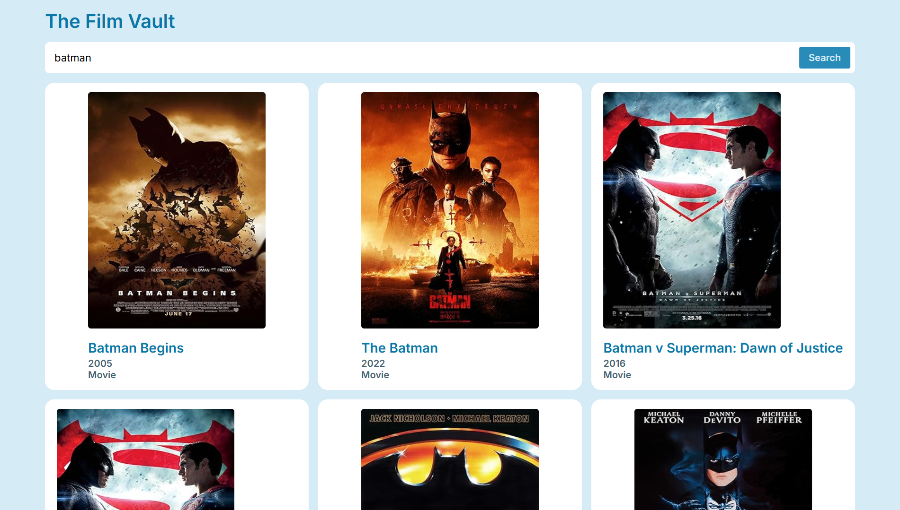
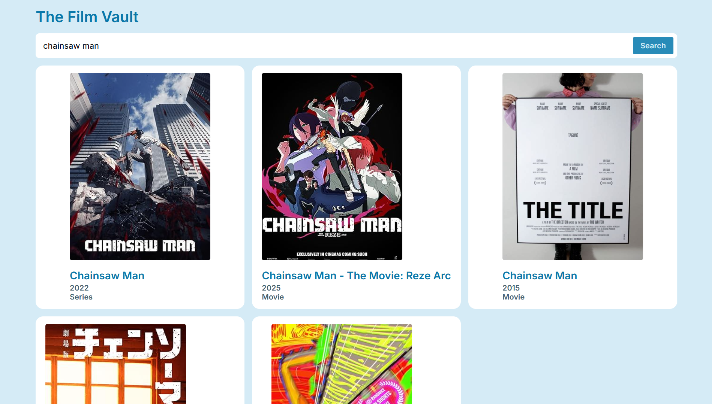
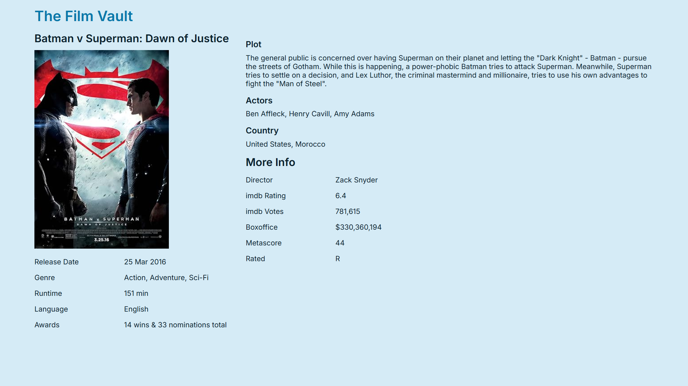
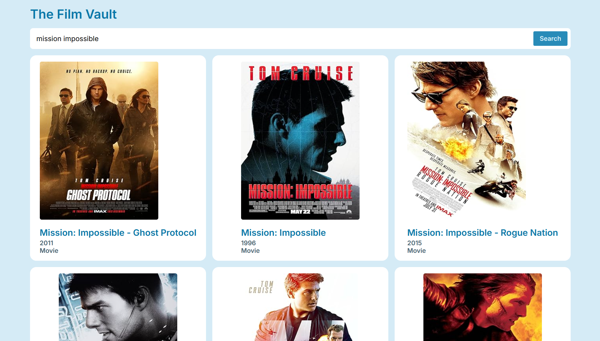

# 🎬 The Film Vault  

  

> A modern movie discovery app built with **React** and **React Router**.  
> Search, explore, and discover your favorite films through a clean, intuitive interface powered by the **OMDB API**.  

---

## 🚀 Features  

- ✅ Search movies by title  
- ✅ Browse detailed movie information  
- ✅ View ratings, cast, and plot  
- ✅ Responsive, fast, and modern UI  
- ✅ Real-time API integration with OMDB  
- ✅ Smooth navigation between pages  

---

## 🛠️ Tech Stack  

- **React.js** ⚛️  
- **React Router** 🛤️  
- **Axios** 📡  
- **CSS Modules** 🎨  
- **OMDB API** 🎥  

---

## 🧠 Highlights  

- **Clean & Modular Codebase** → Organized components and reusable UI parts  
- **Real API Data** → Live movie info from OMDB  
- **React Router Navigation** → Fast and seamless page transitions  
- **Responsive Layout** → Optimized for both desktop and mobile  
- **Error Handling** → Graceful fallbacks for failed API requests  

---

## 🏁 Run It Yourself  

```bash
# Clone the repository
git clone https://github.com/<your-username>/the-film-vault.git

# Navigate to the project directory
cd the-film-vault

# Install dependencies
npm install

# Add your OMDB API key
echo VITE_OMDB_API_KEY="YOUR_API_KEY_HERE" > .env

# Start the development server
npm run dev
```

---

## 📸 Screenshots  

| Home Page | Movie Details | Search Results |
|-----------|---------------|----------------|
|  |  |  |

---

## 📂 Project Structure  

```
the-film-vault/
├── src/
│   ├── assets/
│   │   ├── screenshots/
│   │   ├── LoadingSpinner.svg
│   │   ├── react.svg
│   ├── components/
│   │   ├── MovieCard.jsx
│   │   ├── MovieCard.module.css
│   │   ├── MovieList.jsx
│   │   ├── MoviesList.module.css
│   │   ├── SearchForm.jsx
│   │   ├── SearchForm.module.css
│   ├── pages/
│   │   ├── Home.jsx
│   │   ├── SingleMovieDetail.jsx
│   │   ├── Root.jsx
│   │   ├── Error.jsx
│   ├── constants.js
│   ├── App.jsx
│   ├── main.jsx
├── package.json
├── vite.config.js
├── README.md
```

---

## 🔧 Configuration  

Set up your OMDB API key in the `.env` file:  

```bash
VITE_OMDB_API_KEY=your_api_key_here
```

And in your code:  

```javascript
export const apiKey = import.meta.env.VITE_OMDB_API_KEY;
```

---

## Credits  

⚡ Powered by ArshLabs  
🎥 Data from [OMDB API](https://www.omdbapi.com/)  
